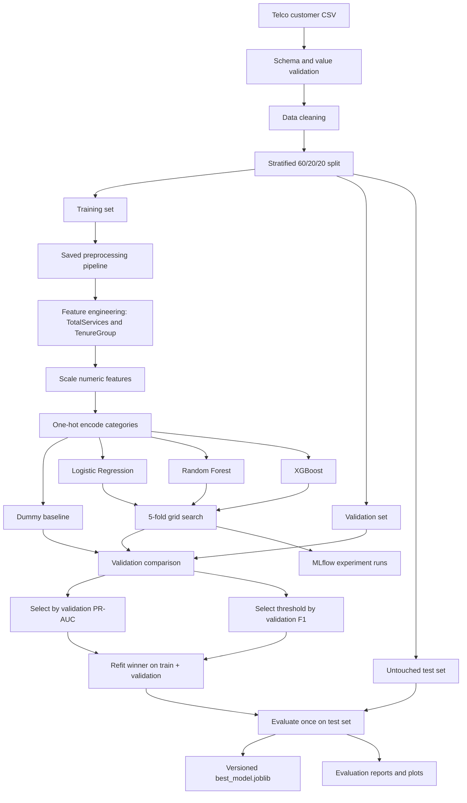
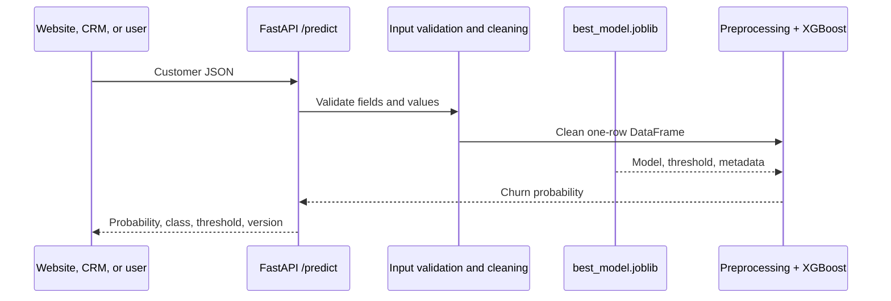
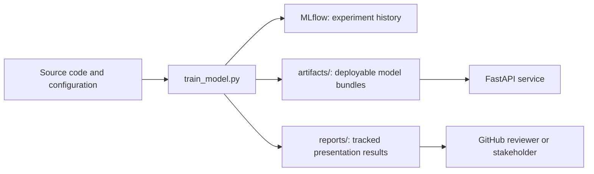

# Project architecture

## Training architecture

The test set is deliberately isolated until the end. It does not influence feature choices, hyperparameters, model selection, or threshold selection.

## Prediction architecture

## Artifact architecture

| Location | Purpose | Committed to Git? |
|---|---|---|
| `src/` | Reusable application and ML code | Yes |
| `configs/training.yaml` | Reproducible experiment settings | Yes |
| `tests/` | Automated behavioral checks | Yes |
| `reports/` | Final human-readable evidence | Yes |
| `artifacts/` | Regenerable model binaries and detailed outputs | No |
| `mlflow.db`, `mlruns/` | Local experiment database and artifacts | No |

## Source-code responsibilities

| File | Responsibility |
|---|---|
| `src/cleaning.py` | Validate columns and values; clean numeric and string fields |
| `src/features.py` | Create `TotalServices` and `TenureGroup` inside the model pipeline |
| `src/preprocessing.py` | Scale numeric variables and encode categorical variables |
| `src/train.py` | Split data, construct models, and perform grid search |
| `src/evaluate.py` | Metrics, thresholds, cross-validation summaries, and plots |
| `src/reporting.py` | Generate the final Markdown evaluation report |
| `src/config.py` | Load YAML configuration and resolve project-relative paths |
| `src/api.py` | Load the final bundle and serve `/health` and `/predict` |
| `train_model.py` | Coordinate the complete training lifecycle |
| `generate_eda_report.py` | Generate reproducible EDA output |
