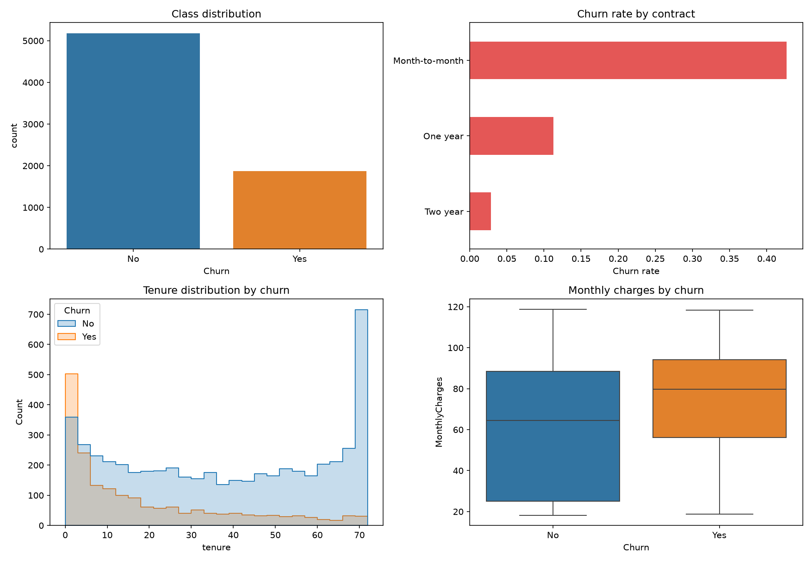

# Exploratory data analysis

## Dataset overview

- Rows: 7,043
- Raw columns: 21
- Churned customers: 1,869
- Overall churn rate: 26.5%
- Blank/non-numeric `TotalCharges`: 11 rows; these are new customers with zero tenure and are set to zero by cleaning.
- Median tenure: 29 months
- Mean monthly charge: $64.76

## Main observations

- Month-to-month customers churn at 42.7%, compared with 2.8% for two-year customers.
- Fiber-optic customers churn at 41.9%, higher than DSL customers.
- Electronic-check customers churn at 45.3%, the highest rate among payment methods.
- Churn is more common among shorter-tenure customers and customers with higher monthly charges.

These observations are descriptive associations. They motivate model features but do not establish causal effects.
