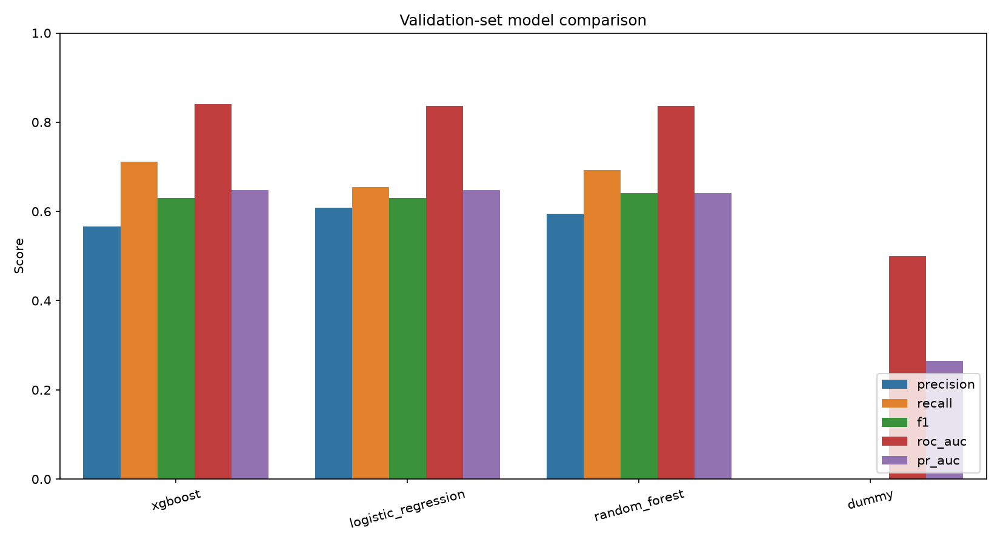
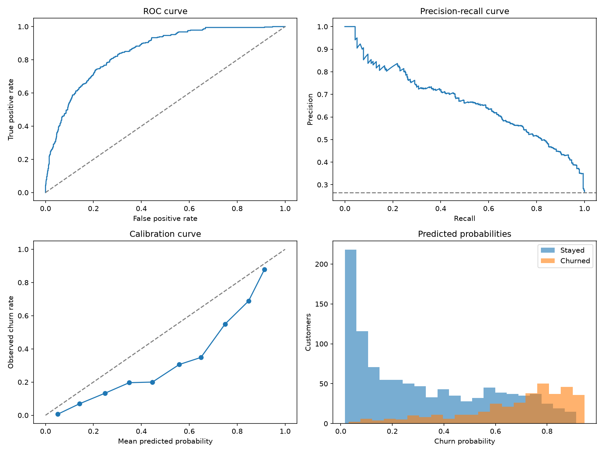
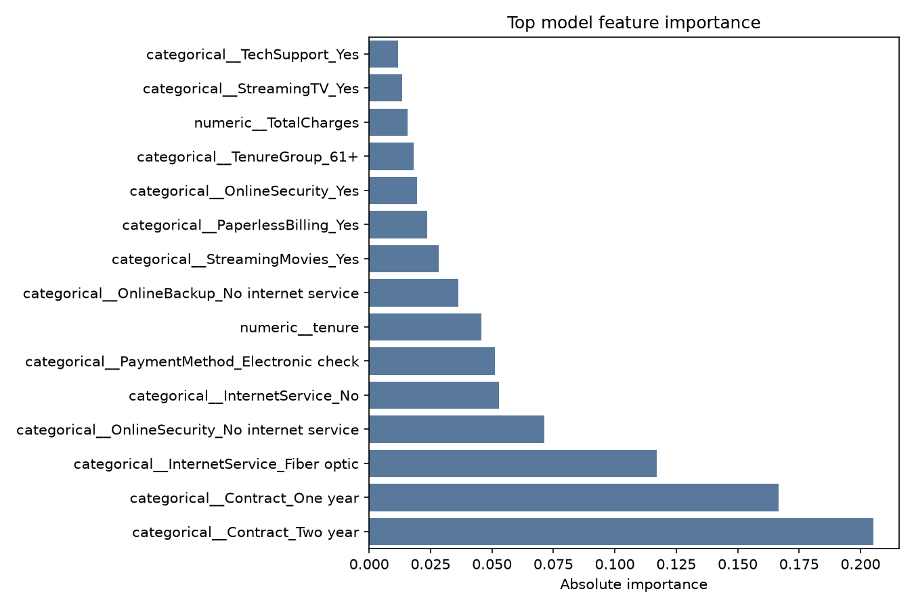

# Customer churn model evaluation

## Executive summary

Four classifiers were compared: a majority-class dummy baseline, logistic regression, random forest, and XGBoost. Models were tuned with stratified cross-validation on the training partition and compared on a separate validation partition using PR-AUC rather than accuracy. **xgboost** was selected and evaluated once on the untouched test partition.

## Data and evaluation design

- Dataset rows: 7,043
- Split: 60% train / 20% validation / 20% test, stratified by churn
- Hyperparameter objective: cross-validated average precision (PR-AUC)
- Model-selection metric: validation PR-AUC
- Threshold-selection metric: validation F1
- Selected probability threshold: 0.60
- Random seed: 42

## Validation model comparison

| model               |   threshold |   accuracy |   balanced_accuracy |   precision |   recall |     f1 |   roc_auc |   pr_auc |   cv_pr_auc |   cv_pr_auc_std |
|:--------------------|------------:|-----------:|--------------------:|------------:|---------:|-------:|----------:|---------:|------------:|----------------:|
| xgboost             |         0.6 |     0.7786 |              0.7571 |      0.566  |   0.7112 | 0.6303 |    0.8411 |   0.6476 |      0.672  |          0.0201 |
| logistic_regression |         0.4 |     0.7963 |              0.7512 |      0.6079 |   0.6551 | 0.6306 |    0.8367 |   0.6471 |      0.6723 |          0.0264 |
| random_forest       |         0.6 |     0.7935 |              0.7612 |      0.5954 |   0.6925 | 0.6403 |    0.837  |   0.641  |      0.6689 |          0.0121 |
| dummy               |         0.5 |     0.7346 |              0.5    |      0      |   0      | 0      |    0.5    |   0.2654 |      0.2653 |          0.0005 |

The top models are close. The winner is retained because it follows the predeclared validation PR-AUC rule; a simpler model may still be preferable when interpretability, latency, or maintenance dominates a very small metric difference.

Accuracy is not sufficient because only about 26.5% of customers churn. A model that predicts “no churn” for everyone achieves roughly 73.5% accuracy while finding zero churners. PR-AUC, recall, F1, ROC-AUC, and the confusion matrix expose that failure.

## Final test results for xgboost

| Metric | Score |
|---|---:|
| Accuracy | 0.7764 |
| Balanced accuracy | 0.7556 |
| Precision | 0.5624 |
| Recall | 0.7112 |
| F1 | 0.6281 |
| ROC-AUC | 0.8470 |
| PR-AUC | 0.6655 |

Confusion matrix counts: 828 true negatives, 207 false positives, 108 false negatives, and 266 true positives.

## Interpretation

Lowering the threshold usually catches more churners but contacts more customers who would not churn. The selected threshold maximizes validation F1 because business-specific retention costs were not supplied. In production, the threshold should instead maximize expected business value.

Feature importance describes predictive association, not causation. Tree importance can also favor variables with more possible split points; permutation or SHAP analysis would be appropriate follow-up work.

## Reproducibility

- Model version: `20260925T183851Z-a1bc5f6d`
- Dataset SHA-256: `88be4b93fbe0cc83421af1c503794c97c342eca914c1576db7c276e61d61358a`
- Git commit at training time: `a1bc5f6d0b0b42d363a6895cd14ac1126316a58e`
- Configuration: `configs/training.yaml`
- Experiment tracking: local MLflow runs in `mlruns/`
